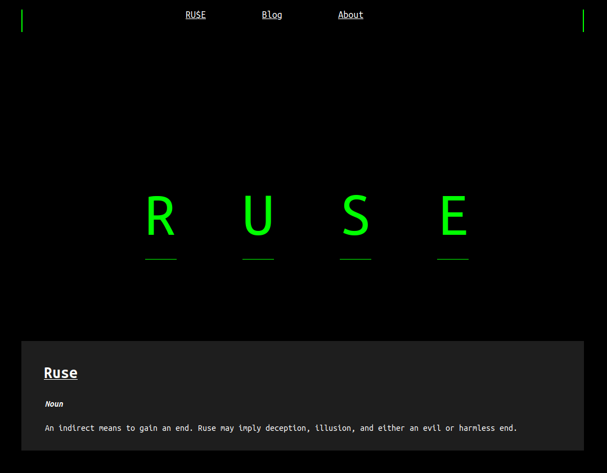
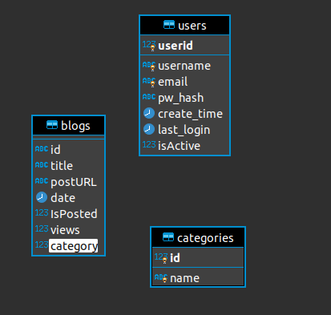
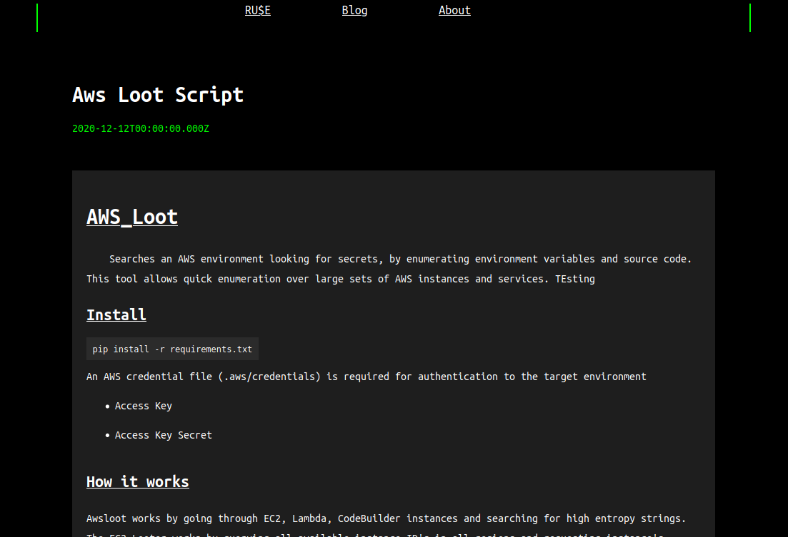
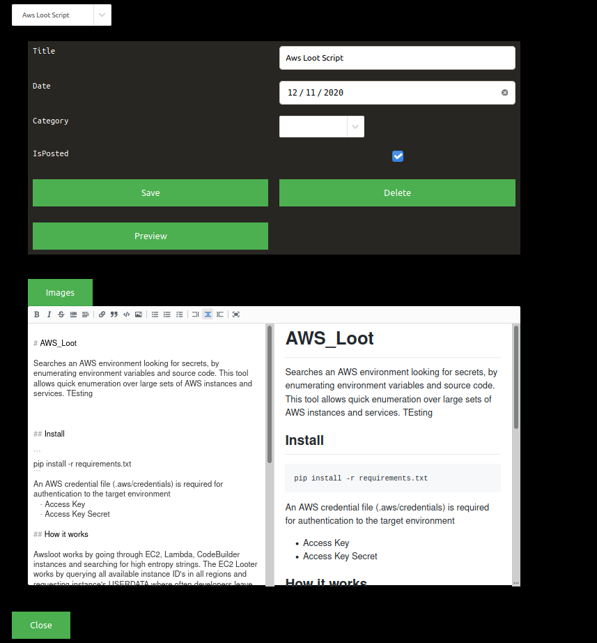

# Ruse.tech

This project is my personal website. The objective of this project was to build a full-stack application that I could use to post and manage my own blogs. Through this project, I experimented with creating my own API written in NodeJs using the express framework, interfaced and managed MySQL database for authentication and metadata, and React for the frontend. 

## Website structure 

### Databse Layer 

For the site, I decided on using Mysql. The database has three tables Users, Categportyies, and Blogs. The user table stores the user's login as well as the password hash. As of right now, there are no roles implemented for the site and the only users added to the site are the admins. Next is the categories table which is a very basic table that stores categories names and id. Finally, the most complicated table is the Blog table. These tables store what I call "blog metadata". This metadata includes the blog id, title, date, views, status (is posted), and category. The id is a UUID and represents a foreign key to the blog file stored in an S3 bucket. Blog posts are created and stored in .md format on an s3 bucket. Each blog is correlated with the UUID in the BLOG table. Overall in future versions, the database could be replaced with Dynamodb

### API Layer

This layer was built using NodeJS Express. This layer servers the information used in the React frontend. The API is consists of two main categories. /Admin, /Blog. Start with /Blog the expected routes are implemented that allow an Admin user to create, delete, and update blogs. /Admin route handles the authentication as well as admin specific actions such as uploading images and user management. When /blog requests the API returns only the metadata about the blogs to the client. When a client requests to view a specific blog only then does the API reach out to the S3 gather the post and return it to be rendered.  Authentication is implemented using JWT tokens and rate limiting is implemented on the authentication routes to prevent abuse. 

### Front End 

This was the most challenging part for me. Having never used React there were many pitfalls including how to manage the state of an authenticated user. After learning more about React I decided to use Redux to help manage state. The un-authenticated portion of the site is relatively simple. The blog list page has some interesting logic which sorts blogs into categories and moved the newest blogs to the top of the list. Blog posts are rendered using .md files which makes blogs easily customizable and render nicely. On the authenticated side is where the frontend gets more complicated. After logging in the Admin user is allowed to select or create a new blog. If an existing blog is selected the blog editor is opened and the user is allowed to update the metadata and post of the blog. Additional new blogs can be created or deleted using the admin interface. The blog editor allows image upload per blog.

### Infra

The website is run on an EC2 with the domain api.ruse.tech and the React client is stored in an S3 bucket. The bucket is attached to a Cloudfront distribution. Images and the blog .md files are stored in S3 buckets as well. The MySQL database is run on the same instance as the API. Ideally, this database would be migrated to RDS or run on a dedicated instance but for cost reasons, it is not. This in the future could be an issue.